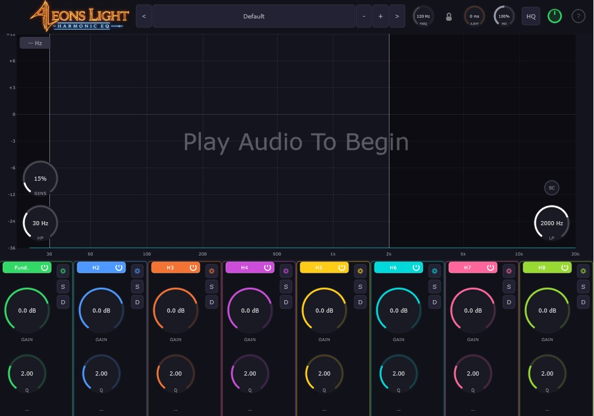
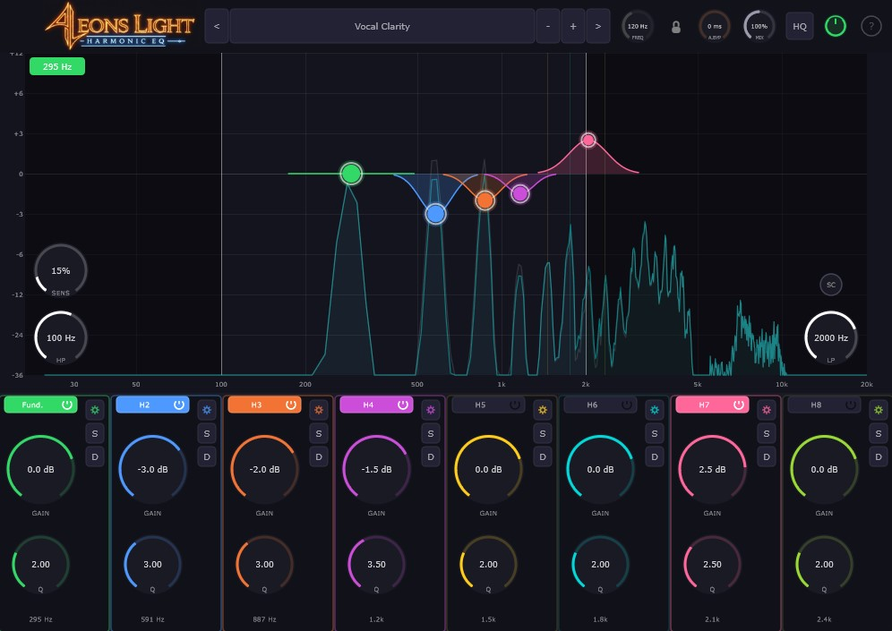
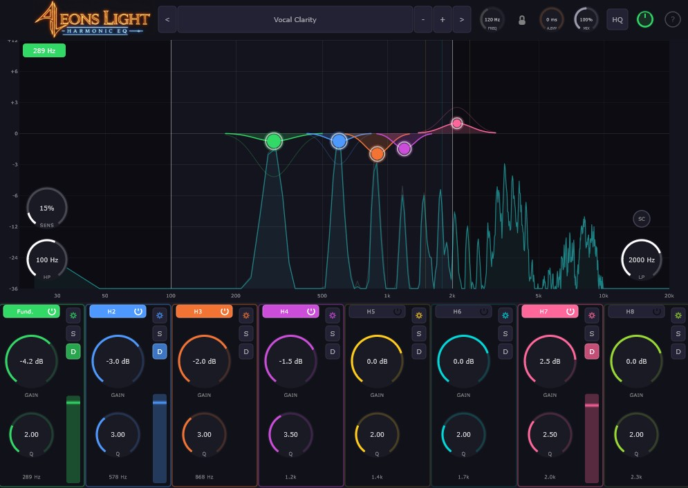

# Harmonic EQ

**Intelligent harmonic-tracking parametric EQ by Aeons Light**

Harmonic EQ automatically detects the fundamental frequency of your audio and positions EQ bands at exact harmonic multiples — shaping individual harmonics in real-time as the pitch changes.

## Features

- **Real-Time Pitch Tracking** — YIN-based detection locks EQ bands to the harmonic series instantly
- **8 Configurable Bands** — assign any harmonic (×2–×16), sub-harmonic, musical interval, or custom multiplier
- **Dynamic Mode** — per-band threshold gating applies EQ only when harmonics exceed your set level
- **Live Spectrum Analyzer** — pre/post FFT display with draggable nodes and bell curve visualization
- **Solo Audition** — isolate any band to hear exactly what the EQ is doing
- **Frequency Lock** — manual frequency override for drones, synths, and single-note processing
- **Sidechain Input** — external pitch detection source
- **22 Factory Presets** — vocal, guitar, bass, drums, de-harsh, creative, mastering

### EQ with Harmonic Tracking

### Dynamic Mode

## Download

### Latest Release: v0.2.2

| Platform | Installer | Individual Formats |
|----------|-----------|-------------------|
| **Windows** | [Download Installer (.exe)](https://github.com/aeons-light/harmonic-eq-releases/releases/latest/download/HarmonicEQ-Windows-Installer.exe) | [VST3](https://github.com/aeons-light/harmonic-eq-releases/releases/latest/download/HarmonicEQ-Windows-VST3.zip) · [CLAP](https://github.com/aeons-light/harmonic-eq-releases/releases/latest/download/HarmonicEQ-Windows-CLAP.zip) |
| **macOS** | [Download Installer (.pkg)](https://github.com/aeons-light/harmonic-eq-releases/releases/latest/download/HarmonicEQ-macOS-Installer.pkg) | [VST3](https://github.com/aeons-light/harmonic-eq-releases/releases/latest/download/HarmonicEQ-macOS-VST3.zip) · [AU](https://github.com/aeons-light/harmonic-eq-releases/releases/latest/download/HarmonicEQ-macOS-AU.zip) · [CLAP](https://github.com/aeons-light/harmonic-eq-releases/releases/latest/download/HarmonicEQ-macOS-CLAP.zip) |
| **Linux** | — | [VST3](https://github.com/aeons-light/harmonic-eq-releases/releases/latest/download/HarmonicEQ-Linux-VST3.zip) · [CLAP](https://github.com/aeons-light/harmonic-eq-releases/releases/latest/download/HarmonicEQ-Linux-CLAP.zip) |

> Free trial — full functionality with a brief nag screen. Purchase a license at [aeonslight.com](https://www.aeonslight.com) to remove it.

## System Requirements

- Windows 10+ (64-bit)
- macOS 11+ (Intel & Apple Silicon)
- Linux (64-bit)
- Any DAW supporting VST3, CLAP, or AU

## License

$50 — Lifetime license. No subscriptions, no activation limits.

[Buy Now](https://buy.stripe.com/6oU9AS4KTckCg5UfKZ3cc01)

---

© 2026 Aeons Light. All rights reserved.
