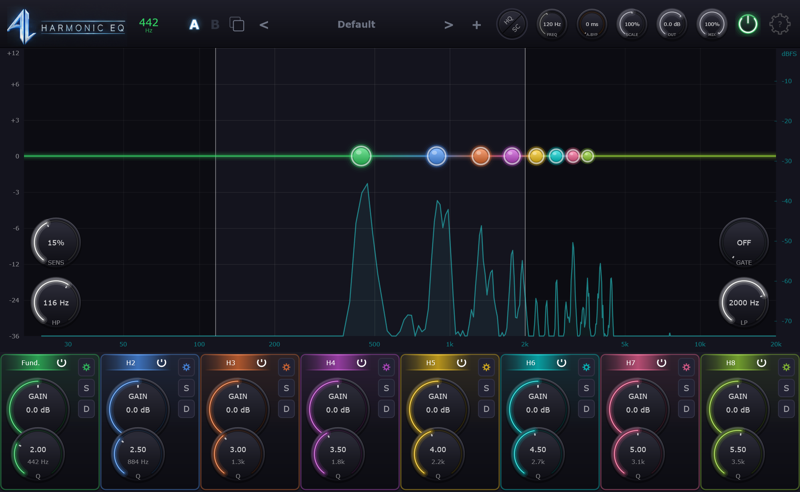
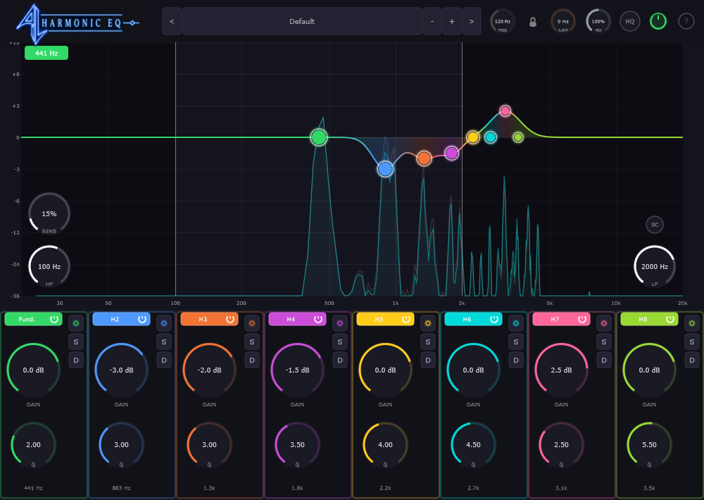
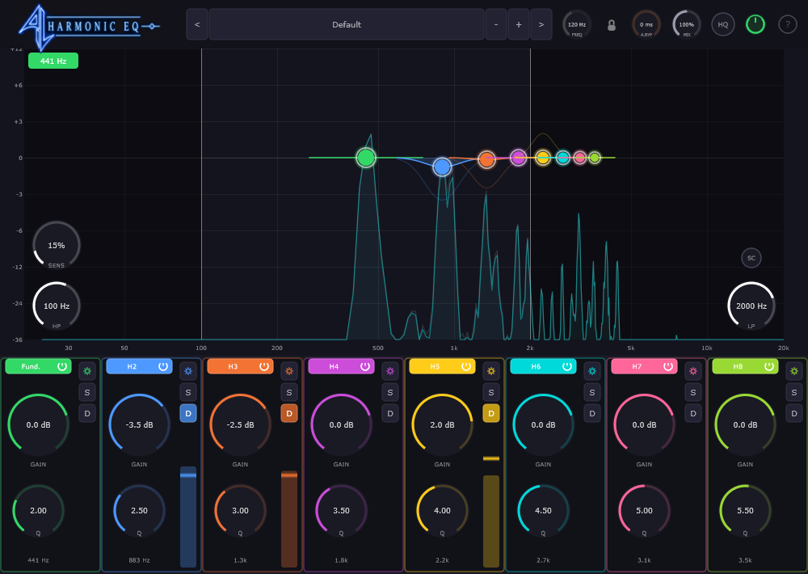
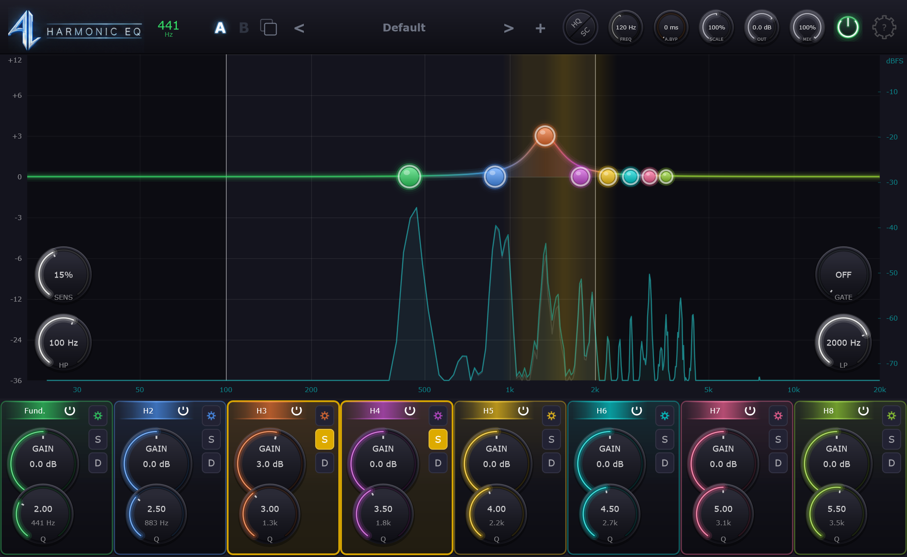
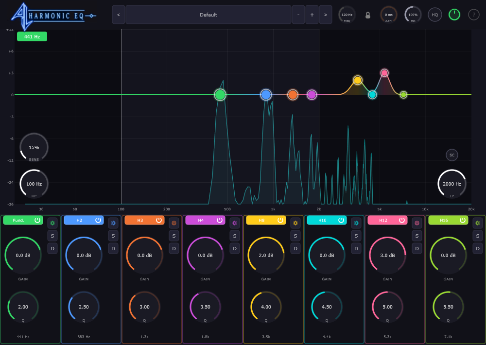

# Harmonic EQ

**Intelligent harmonic-tracking parametric EQ by Aeons Light**

Harmonic EQ automatically detects the fundamental frequency of your audio and positions EQ bands at exact harmonic multiples — shaping individual harmonics in real-time as the pitch changes.

## Features

- **Follows Every Note** — bands lock onto the fundamental and ride the harmonic series in real time
- **8 Configurable Bands** — assign any harmonic (×2–×16), sub-harmonic, musical interval, or custom multiplier
- **Dynamic Mode** — per-band threshold gating applies EQ only when harmonics exceed your set level
- **Live Spectrum Analyzer** — pre/post FFT display with draggable nodes and bell curve visualization
- **Solo Audition** — isolate any band to hear exactly what the EQ is doing
- **Frequency Lock** — manual frequency override for drones, synths, and single-note processing
- **Sidechain Input** — external pitch detection source
- **55 Factory Presets** — vocal, guitar, bass, drums, de-harsh, creative, mastering, advanced

### EQ with Harmonic Tracking

### Dynamic Mode

### Solo Audition

### Higher Harmonics

## Download

### Latest Release

| Platform | Download |
|----------|----------|
| **Windows** | [Download Installer (.exe)](https://github.com/aeons-light/harmonic-eq-releases/releases/latest/download/HarmonicEQ-Windows-Installer.exe) |
| **macOS** | [Download Installer (.pkg)](https://github.com/aeons-light/harmonic-eq-releases/releases/latest/download/HarmonicEQ-macOS-Installer.pkg) |
| **Linux** | [Download VST3](https://github.com/aeons-light/harmonic-eq-releases/releases/latest/download/HarmonicEQ-Linux-VST3.zip) · [Download CLAP](https://github.com/aeons-light/harmonic-eq-releases/releases/latest/download/HarmonicEQ-Linux-CLAP.zip) |

> Try it free with full functionality. Purchase a license at [aeonslight.com](https://www.aeonslight.com) to unlock.

## Changelog

### v0.2.12
**Improved**
- The Windows installer is now signed, so it installs without security warnings

### v0.2.11
Various bug fixes and refinements.

### v0.2.10
**Improved**
- The macOS installer is now signed and notarized by Apple, so it installs without security warnings

### v0.2.9
**Improved**
- Pitch readout moved to the header, colour-coded to show tracking state at a glance
- Sensitivity knob rescaled for finer control in the useful range

Various bug fixes and refinements.

### v0.2.8
**Improved**
- The EQ graph now draws one continuous curve with band colours blending together

Various bug fixes and stability improvements. Updating is recommended for anyone using HQ mode.

### v0.2.7
**Improved**
- Band nodes stay at their gain setting in Dynamic mode, making them easier to drag

Various bug fixes.

### v0.2.6
**New**
- HQ mode adds 8x oversampling for higher quality processing
- Analyzer status messages for unpitched audio and auto-bypass

Various bug fixes and refinements.

---

## System Requirements

- Windows 10+ (64-bit)
- macOS 11+ (Intel & Apple Silicon)
- Linux (64-bit)
- Any DAW supporting VST3, CLAP, or AU

## License

$50 — Pay once, keep your license forever.

[Buy Now](https://buy.stripe.com/6oU9AS4KTckCg5UfKZ3cc01)

---

© 2026 Aeons Light. All rights reserved.
